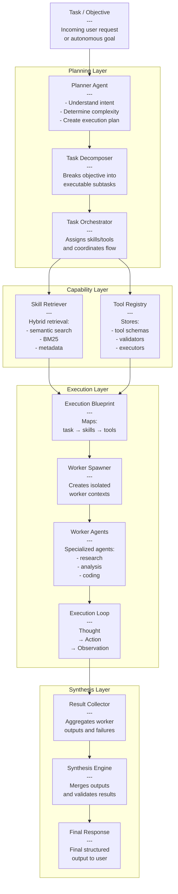

---
tags:
  - ai
  - agents
  - multi-agent
  - architecture
---

### Agents:
- [[Planner Agent]] 
	- Planning, Decomposition, Routing
	- Task and Skill Delegation
	- Agent Spawning
- [[Retrieval Agent]]
	- Given Skill and Task
	- Retrieves Infromation from Documents
- [[Worker Agent]]
	- ReAct type agent
	- Skill Executor

### Services:
- [[Agent Manager]]
- [[Skill Manager]]
- [[Tool Manager]]
- [[RAG Manager]]
- 
