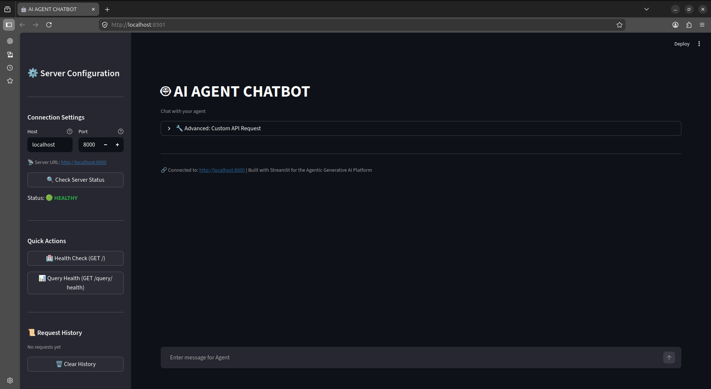

# GenAI Platform App — Work in Progress

> ⚠️ This project is actively under development. Features and architecture may change.

An **Agentic Generative AI Platform** for developing, testing, and deploying AI agents with RAG (Retrieval-Augmented Generation) capabilities. The platform consists of a **FastAPI backend** and a **Streamlit chat interface frontend**.

---

## Project Structure

```
GenAI_Platform_App/
├── backend/                    # FastAPI backend
│   ├── app/
│   │   ├── api/               # REST API endpoints (agent, documents, query)
│   │   ├── core/              # Core logic (workflows, prompts)
│   │   └── services/          # LLM, RAG, vector store services
│   └── tests/                 # Unit tests
├── frontend/
│   └── streamlit_app/         # Streamlit chat interface
├── docker-compose.yaml        # Docker orchestration
├── requirements.txt           # Python dependencies
└── setup.sql                  # Database setup
```

---

## Tech Stack

**Backend:**
- FastAPI + Uvicorn
- LangChain / LangGraph
- Vector stores: FAISS, Pinecone, Qdrant, Milvus
- Redis, PostgreSQL
- (future):
    - langflow, Prometheus, grafana

**Frontend:**
- Streamlit (chat UI)

**Dependencies:** See `requirements.txt`

---

## Backend Quick Start

Choose one of the following Backend deployment methods:

---

### Option 1: Full Docker Setup (Recommended)
Runs **Backend, Redis, PostgreSQL database** all inside docker containers.
You only need docker installed for this option.

```bash
# Build and start all services
docker-compose up --build
```

---

### Option 2: Run Backend Locally (without Docker)
Use this for backend development. You will need to run Redis separately.

#### Prerequisites:
```bash
# Install backend dependencies
cd backend
pip install -r requirements.txt
```

#### Step 1: Start Redis database
```bash
docker run -d --name redis-stack -p 6379:6379 -p 8001:8001 redis/redis-stack:latest
```

#### Step 2: Start FastAPI backend server
```bash
# From backend/ directory
uvicorn app.main:app --reload --host 0.0.0.0 --port 8000
```

---

## Frontend Quick Start
Frontend can be run independently and will connect to a running backend instance.

```bash
# Install frontend dependencies (first run only)
cd frontend/streamlit_app
pip install -r requirements.txt

# Start Streamlit UI
streamlit run app.py
```

Frontend will open automatically at: http://localhost:8501

---

## Streamlit App Screenshots



---

## Todo

- improve observability
    - [] Langfuse → tracing
    - [] Prometheus → metrics
    - [] Grafana → dashboard
- Agent Memory Management 
    - [x] current chat session context memory
    - [] Episodic memory(daily and per session log)
    - [] Semmantic (user info)
- agent tools
    - [] memory retrieval (RAG, cached memory search)
    - [] context compaction
    - other usefull tools
- research about:
    - [] LlamaIndex – structured data + retrieval
    - [] DSPy – declarative prompting + optimization

---

## 📄 License

_TBD_